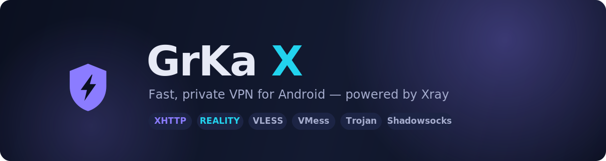
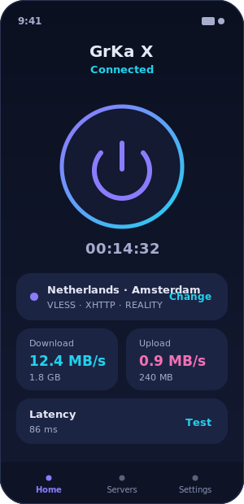
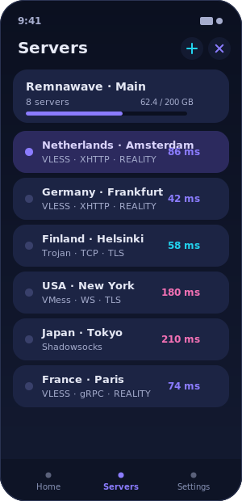
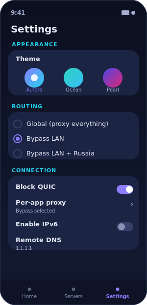

  

  
  
  
  
  

  <b>GrKa X</b> — быстрый и приватный VPN-клиент для Android на ядре <b>Xray</b>. 
  Современные транспорты, включая <b>XHTTP</b>, обход блокировок и приятный интерфейс с тремя темами.

  
  &nbsp;&nbsp;
  
  &nbsp;&nbsp;
  

---

## Что это

GrKa X подключает ваш телефон к личному VPN-серверу и пропускает через него интернет-трафик — чтобы соединение было **зашифрованным**, а заблокированные сайты и сервисы снова открывались. Приложение понимает ссылки и подписки от популярных панелей (в том числе **Remnawave**), само обновляет список серверов и применяет правила маршрутизации.

Никакой рекламы, аккаунтов и телеметрии. Вы приносите свой сервер (или ссылку от провайдера) — приложение делает остальное.

## Возможности

🚀 **Ядро Xray** — стабильная сборка с полной поддержкой **XHTTP**, а также WebSocket, gRPC, HTTPUpgrade, mKCP и HTTP/2.

🔐 **Протоколы** — VLESS, VMess, Trojan, Shadowsocks; шифрование **TLS** и **REALITY**.

📥 **Подписки** — вставьте ссылку, и серверы подтянутся сами. Поддержка формата **xray-json** с правилами маршрутизации из панели, заголовок `x-hwid` для панелей с лимитом устройств (Remnawave), отображение остатка трафика и срока действия.

🧭 **Маршрутизация** — готовые режимы (глобально / в обход локальной сети / в обход России) либо ваш собственный шаблон роутинга прямо из подписки.

📱 **Split-tunnel** — выберите приложения, которые пойдут мимо VPN, или наоборот — только они через VPN.

🧪 **Пинг серверов** — проверка реальной задержки каждого сервера и активного соединения в один тап.

🔎 **Прозрачность** — просмотр исходного ответа подписки и итогового конфига, экран логов ядра для диагностики.

🎨 **Три темы оформления** — Aurora, Ocean, Pearl. Русский и английский языки. Автозапуск при загрузке, статистика скорости и объёма.

## Установка

1. Откройте **[страницу релизов](https://github.com/Soporif1c/GrKaX/releases/latest)**.
2. Скачайте APK под свой процессор:
   - **arm64-v8a** — почти все современные телефоны *(рекомендуется)*;
   - **armeabi-v7a** — старые устройства;
   - **universal** — если не уверены (подойдёт всем, но файл больше).
3. Установите APK (может потребоваться разрешить установку из этого источника).
4. Проверить обновления можно прямо в приложении: **Настройки → Проверить обновления**.

> Android 8.0 (Oreo) и новее.

## Быстрый старт

1. Откройте вкладку **Серверы** и нажмите **＋**:
   - **Добавить подписку** — вставьте ссылку от вашей панели;
   - либо **Вставить ссылку** / **Импорт из буфера** для одиночного сервера (`vless://`, `vmess://`, `trojan://`, `ss://`).
2. Выберите сервер в списке (можно нажать **↻**, чтобы измерить пинг всех сразу).
3. Перейдите на **Главную** и нажмите большую кнопку — готово.

## Протоколы и транспорты

| Протоколы | Транспорты | Безопасность |
|---|---|---|
| VLESS · VMess · Trojan · Shadowsocks | TCP · WebSocket · gRPC · HTTPUpgrade · **XHTTP** · mKCP · HTTP/2 | TLS · REALITY |

## Темы

| Aurora | Ocean | Pearl |
|:--:|:--:|:--:|
| Тёмно-синяя с неоновым фиолетово-голубым акцентом | Глубокая бирюза морских глубин | Светлая минималистичная с индиго |

## Сборка из исходников

Сборка полностью автоматизирована в **GitHub Actions** (`.github/workflows/build.yml`): скачивается ядро Xray, компилируется туннель `hev-socks5-tunnel` под все ABI, подтягиваются geo-файлы и собираются подписанные APK.

Своя сборка: сделайте форк, при желании добавьте секреты для подписи (`APP_KEYSTORE_BASE64`, `APP_KEYSTORE_PASSWORD`, `APP_KEYSTORE_ALIAS`, `APP_KEY_PASSWORD`) и запустите workflow. Без секретов APK подписывается debug-ключом — устанавливается и работает.

## Благодарности

- [Xray-core](https://github.com/XTLS/Xray-core) — ядро
- [AndroidLibXrayLite](https://github.com/2dust/AndroidLibXrayLite) — обёртка ядра для Android
- [hev-socks5-tunnel](https://github.com/heiher/hev-socks5-tunnel) — TUN → SOCKS туннель

## Лицензия

[GPL-3.0](LICENSE). Проект не связан с XTLS/Xray и распространяется как есть.

Сделано с ❤️ для тех, кому нужен свободный интернет.

