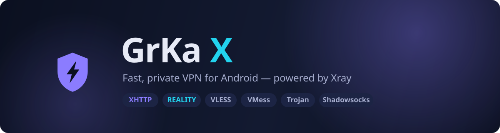
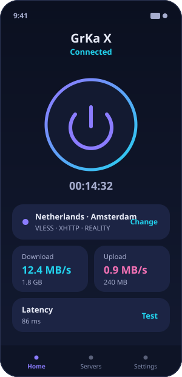
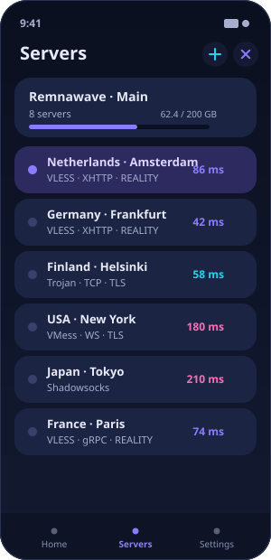
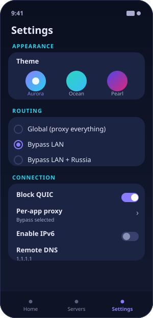
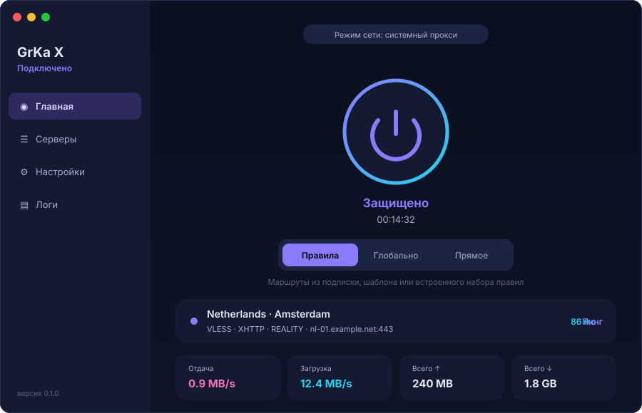
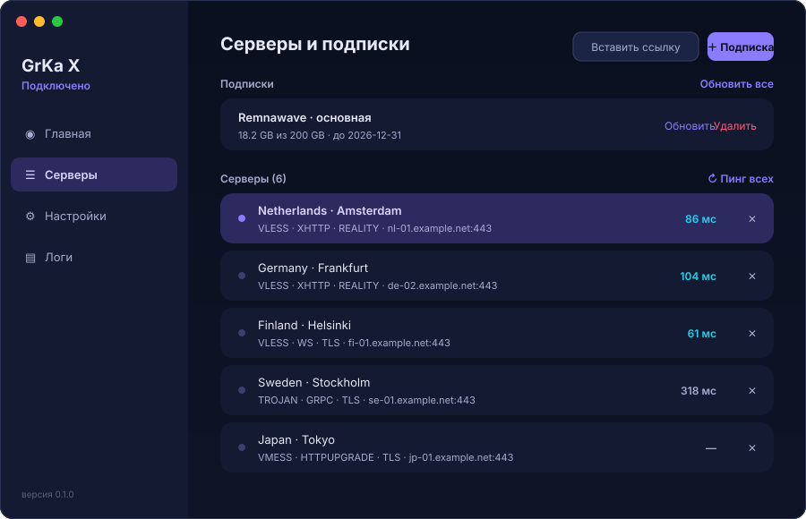
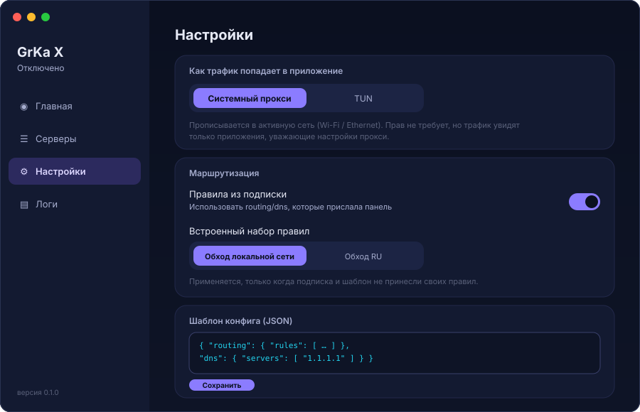

<p align="center">
  
</p>

<p align="center">
  <a href="https://github.com/Soporif1c/GrKaX/releases/latest"></a>
  <a href="https://github.com/Soporif1c/GrKaX/releases"></a>
  
  
  
  <a href="LICENSE"></a>
</p>

<p align="center">
  <b>GrKa X</b> — быстрый и приватный VPN-клиент на ядре <b>Xray</b> для <b>Android</b> и <b>macOS</b>.<br>
  Безопасное зашифрованное соединение, современные транспорты (включая <b>XHTTP</b>) и приятный интерфейс с тремя темами.
</p>

## Скриншоты

<details open>
<summary><b>📱 Android</b> (нажмите, чтобы свернуть)</summary>
<br>
<p align="center">
  
  &nbsp;&nbsp;
  
  &nbsp;&nbsp;
  
</p>
</details>

<details>
<summary><b>🖥 macOS</b> (нажмите, чтобы раскрыть)</summary>
<br>
<p align="center">
  
  <br><br>
  
  <br><br>
  
</p>
</details>

---

## Что это

GrKa X подключает ваше устройство к вашему личному VPN-серверу и пропускает через него интернет-трафик по **зашифрованному** каналу. Это защищает соединение и приватность — например, в открытых Wi-Fi сетях. Приложение понимает ссылки и подписки от популярных панелей (в том числе **Remnawave**), само обновляет список серверов и применяет правила маршрутизации.

Клиенты для Android и macOS используют одно ядро и один код разбора подписок, так что подписка, которая работает на телефоне, работает и на маке.

Никакой рекламы, аккаунтов и телеметрии. Вы приносите свой сервер (или ссылку от провайдера) — приложение делает остальное.

## Возможности

🚀 **Ядро Xray** — стабильная сборка с полной поддержкой **XHTTP**, а также WebSocket, gRPC, HTTPUpgrade, mKCP и HTTP/2.

🔐 **Протоколы** — VLESS, VMess, Trojan, Shadowsocks; шифрование **TLS** и **REALITY**.

📥 **Подписки** — вставьте ссылку, и серверы подтянутся сами. Поддержка формата **xray-json** с правилами маршрутизации из панели, заголовок `x-hwid` для панелей с лимитом устройств (Remnawave), отображение остатка трафика и срока действия.

🧭 **Гибкая маршрутизация** — готовые режимы или ваш собственный шаблон роутинга прямо из подписки: часть трафика идёт через VPN, часть — напрямую, по вашим правилам. Переключатель **Правила / Глобально / Прямое** прямо рядом с кнопкой подключения.

📱 **Split-tunnel** *(Android)* — выберите приложения, которые пойдут мимо VPN, или наоборот — только они через VPN.

🖥 **Два режима на macOS** — системный прокси без прав администратора или полноценный TUN, перехватывающий весь трафик.

🧪 **Пинг серверов** — проверка реальной задержки каждого сервера и активного соединения в один тап.

🔎 **Прозрачность** — просмотр исходного ответа подписки и итогового конфига, экран логов ядра для диагностики.

🎨 **Три темы оформления** — Aurora, Ocean, Pearl. Русский и английский языки. Автозапуск при загрузке, статистика скорости и объёма.

## Установка на Android

1. Откройте **[страницу релизов](https://github.com/Soporif1c/GrKaX/releases/latest)**.
2. Скачайте APK под свой процессор:
   - **arm64-v8a** — почти все современные телефоны *(рекомендуется)*;
   - **armeabi-v7a** — старые устройства;
   - **universal** — если не уверены (подойдёт всем, но файл больше).
3. Установите APK (может потребоваться разрешить установку из этого источника).
4. Дальше можно обновляться **прямо из приложения**: **Настройки → Проверить обновления** — оно само скачает нужный APK и предложит установить.

> Android 8.0 (Oreo) и новее. Проект в активной разработке.

## Установка на macOS

1. Скачайте `.dmg` со **[страницы релизов](https://github.com/Soporif1c/GrKaX/releases/latest)**:
   - **arm64** — Mac на Apple Silicon (M1 и новее) *(рекомендуется)*;
   - **x64** — Mac на процессоре Intel.
2. Откройте образ и перетащите **GrKa X** в «Программы».
3. **Первый запуск.** Приложение пока не подписано сертификатом Apple Developer, поэтому macOS сначала откажется его открывать. Снимите карантин одной командой в Терминале:

   ```sh
   xattr -dr com.apple.quarantine "/Applications/GrKa X.app"
   ```

   Либо: запустите, дождитесь предупреждения и разрешите запуск в **Системные настройки → Конфиденциальность и безопасность → «Открыть всё равно»**.

> macOS 12 (Monterey) и новее.

### Как трафик попадает в приложение

| Режим | Что делает | Права |
|---|---|---|
| **Системный прокси** *(по умолчанию)* | Прописывает SOCKS и HTTP-прокси в активную сеть через `networksetup` | Не требуются |
| **TUN** | Поднимает `utun`-интерфейс и заворачивает в него весь трафик | Пароль администратора при подключении |

Системный прокси видят браузеры и большинство приложений; TUN перехватывает вообще всё, включая программы, которые настройки прокси игнорируют.

### Переключатель режима трафика

Рядом с кнопкой подключения — переключатель **Правила / Глобально / Прямое** (как в Karing):

- **Правила** — маршруты берутся из подписки, вашего JSON-шаблона или встроенного набора;
- **Глобально** — весь трафик идёт через сервер, кроме локальной сети;
- **Прямое** — трафик идёт напрямую, ядро остаётся запущенным, поэтому переключение мгновенное.

> **Почему нет выбора приложений, как на Android.** Per-app VPN на macOS доступен только через корпоративные MDM-профили. Обходной путь — правила по имени процесса — есть у ядер sing-box и mihomo, но не у **Xray**, а именно Xray нужен для сквозной передачи XHTTP-обфускации. Поэтому маршрутизация здесь по правилам, а не по приложениям.

## Быстрый старт

1. Откройте вкладку **Серверы** и нажмите **＋**:
   - **Добавить подписку** — вставьте ссылку от вашей панели;
   - либо **Вставить ссылку** / **Импорт из буфера** для одиночного сервера (`vless://`, `vmess://`, `trojan://`, `ss://`).
2. Выберите сервер в списке (можно нажать **↻**, чтобы измерить пинг всех сразу).
3. Нажмите большую кнопку на **Главной** — готово.

> **Своя маршрутизация.** Если ваша панель отдаёт подписку обычными ссылками (без правил роутинга), вставьте JSON-шаблон с нужными `routing`/`dns` в **Настройки → Шаблон конфига (JSON)** — приложение применит их к каждому подключению.

## Добавление по ссылке (deep link)

Чтобы на странице подписки сделать кнопку «Добавить в GrKa X», используйте:

```
grkax://install-sub?url=<URL_вашей_подписки>
```

<details>
<summary><b>Все поддерживаемые ссылки</b> (нажмите, чтобы раскрыть)</summary>

**Своя схема — добавить подписку:**

| Ссылка | Что делает |
|---|---|
| `grkax://install-sub?url=<URL>` | Добавляет подписку и сразу обновляет её *(рекомендуется)* |
| `grkax://import/<URL>` | То же самое, URL в пути |
| `grkax://install-config?url=<URL>` | То же самое |
| `grkax://add/<URL>` | То же самое |

Если вместо ссылки на подписку передать сами ссылки серверов (или base64-список), они добавятся как серверы.

**Прямые ссылки серверов** — открываются приложением как одиночный сервер:

```
vless://…    vmess://…    trojan://…    ss://…
```

**Чужие схемы** — приложение предложит себя, если на странице уже есть кнопка для другого клиента:

```
v2raytun://…   v2rayng://…   hiddify://…   streisand://…   sn://…
```

> В Remnawave можно добавить своё приложение с deep link `grkax://install-sub?url={SUBSCRIPTION_URL}` — тогда кнопка на странице подписки будет вести прямо в GrKa X.

</details>

## Постоянные ссылки на скачивание

Эти ссылки **всегда** ведут на последнюю версию — их можно смело давать пользователям или размещать на странице подписки:

| Архитектура | Ссылка |
|---|---|
| **arm64-v8a** *(большинство телефонов)* | [`…/releases/latest/download/app-arm64-v8a-release.apk`](https://github.com/Soporif1c/GrKaX/releases/latest/download/app-arm64-v8a-release.apk) |
| **universal** *(подойдёт всем)* | [`…/releases/latest/download/app-universal-release.apk`](https://github.com/Soporif1c/GrKaX/releases/latest/download/app-universal-release.apk) |
| armeabi-v7a *(старые)* | [`…/releases/latest/download/app-armeabi-v7a-release.apk`](https://github.com/Soporif1c/GrKaX/releases/latest/download/app-armeabi-v7a-release.apk) |
| x86_64 | [`…/releases/latest/download/app-x86_64-release.apk`](https://github.com/Soporif1c/GrKaX/releases/latest/download/app-x86_64-release.apk) |
| x86 | [`…/releases/latest/download/app-x86-release.apk`](https://github.com/Soporif1c/GrKaX/releases/latest/download/app-x86-release.apk) |

macOS:

| Процессор | Ссылка |
|---|---|
| **Apple Silicon** *(M1 и новее)* | [`…/releases/latest/download/GrKaX-macos-arm64.dmg`](https://github.com/Soporif1c/GrKaX/releases/latest/download/GrKaX-macos-arm64.dmg) |
| Intel | [`…/releases/latest/download/GrKaX-macos-x64.dmg`](https://github.com/Soporif1c/GrKaX/releases/latest/download/GrKaX-macos-x64.dmg) |

Страница последнего релиза: **[github.com/Soporif1c/GrKaX/releases/latest](https://github.com/Soporif1c/GrKaX/releases/latest)**

## Протоколы и транспорты

| Протоколы | Транспорты | Безопасность |
|---|---|---|
| VLESS · VMess · Trojan · Shadowsocks | TCP · WebSocket · gRPC · HTTPUpgrade · **XHTTP** · mKCP · HTTP/2 | TLS · REALITY |

## Темы

| Aurora | Ocean | Pearl |
|:--:|:--:|:--:|
| Тёмно-синяя с неоновым фиолетово-голубым акцентом | Глубокая бирюза морских глубин | Светлая минималистичная с индиго |

## Структура репозитория

| Каталог | Что там |
|---|---|
| [`app/`](app/) | Android-клиент (Kotlin + Jetpack Compose, ядро через `libv2ray`) |
| [`desktop/`](desktop/) | Клиент для macOS (Kotlin + Compose Multiplatform, ядро — дочерний процесс `xray`) |
| [`docs/`](docs/) | Баннер, иконки и макеты экранов |

Разбор ссылок, парсер xray-json подписок и сборщик конфига написаны одинаково для обеих платформ — при правке одного не забудьте про второй.

## Сборка из исходников

Всё собирается в **GitHub Actions**, локальный Android SDK или Xcode не нужны.

**Android** (`.github/workflows/build.yml`): скачивается ядро Xray, компилируется туннель `hev-socks5-tunnel` под все ABI, подтягиваются geo-файлы и собираются подписанные APK. Своя сборка: сделайте форк, при желании добавьте секреты для подписи (`APP_KEYSTORE_BASE64`, `APP_KEYSTORE_PASSWORD`, `APP_KEYSTORE_ALIAS`, `APP_KEY_PASSWORD`) и запустите workflow. Без секретов APK подписывается debug-ключом — устанавливается и работает.

**macOS** (`.github/workflows/build-macos.yml`): на macOS-раннерах скачиваются бинарники `xray` и `tun2socks`, кладутся в бандл вместе с geo-файлами, `jpackage` собирает `.app` и `.dmg` под arm64 и x64. Подпись — ad-hoc (обязательна на Apple Silicon), нотаризации нет: для неё нужен платный Apple Developer Program.

Локально десктоп можно запустить без мака — нужен только JDK 21:

```sh
cd desktop && ./gradlew run
```

## Благодарности

- [Xray-core](https://github.com/XTLS/Xray-core) — ядро
- [AndroidLibXrayLite](https://github.com/2dust/AndroidLibXrayLite) — обёртка ядра для Android
- [hev-socks5-tunnel](https://github.com/heiher/hev-socks5-tunnel) — TUN → SOCKS туннель на Android
- [tun2socks](https://github.com/xjasonlyu/tun2socks) — TUN → SOCKS туннель на macOS

## Лицензия

[GPL-3.0](LICENSE). Проект не связан с XTLS/Xray и распространяется как есть.

<p align="center"><sub>Сделано с ❤️ для безопасного и приватного соединения.</sub></p>
